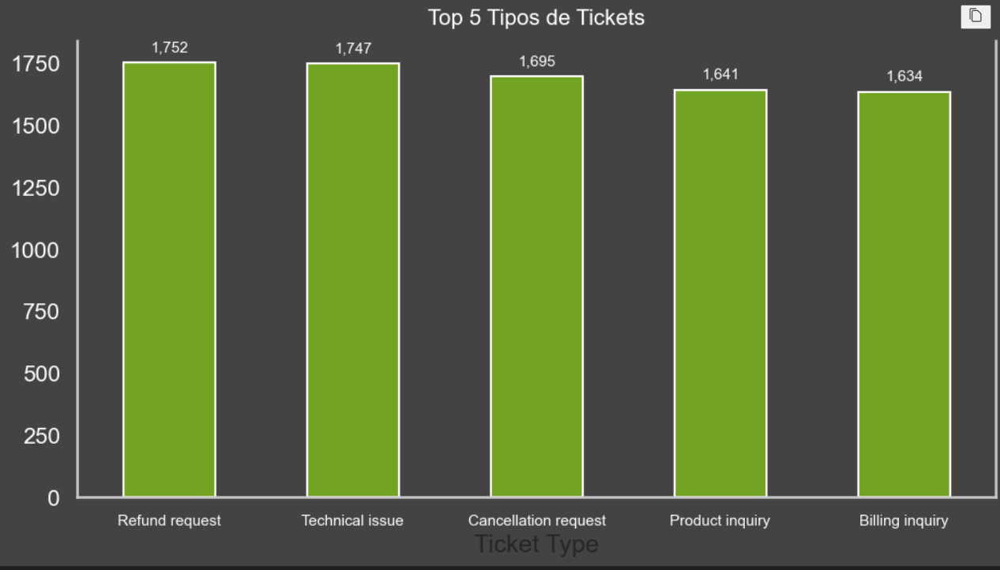
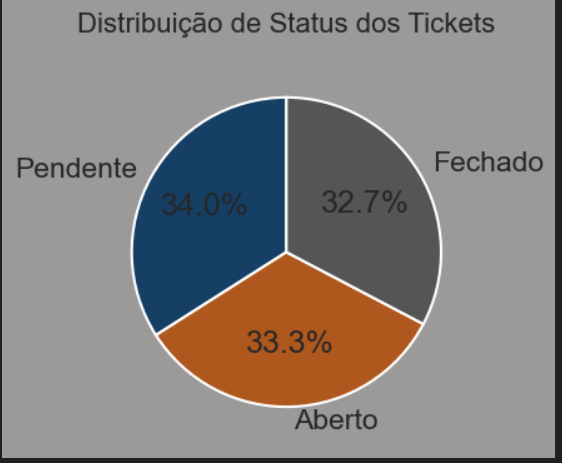

# Análise de Tickets de Help Desk

Uma análise completa de dados de chamados de atendimento ao cliente (helpdesk), focando em identificar padrões de prioridade, tempo de resolução e tipos de problemas recorrentes.

## Objetivo

Este projeto analisa um dataset de mais de 5.000 tickets de suporte técnico para:
- Avaliar a distribuição e status dos tickets
- Identificar gargalos no tempo de resolução por prioridade
- Reconhecer os tipos de problemas mais frequentes
- Fornecer insights acionáveis para gestores de TI

##  Dataset

- **Arquivo**: `customer_support_tickets.csv` (~3.9 MB)
- **Registros**: 5.000+ tickets de suporte
- **Colunas principais**:
  - `Ticket ID` - Identificador único
  - `Ticket Type` - Tipo de problema (Technical issue, Billing inquiry, etc.)
  - `Ticket Priority` - Crítico, Alto, Médio, Baixo
  - `Ticket Status` - Aberto, Fechado, Pendente
  - `First Response Time` - Tempo da primeira resposta
  - `Time to Resolution` - Tempo de resolução completa
  - `Customer Satisfaction Rating` - Satisfação do cliente
  - Informações do cliente (nome, email, idade, produto comprado)

##  Estrutura do Projeto

```
.
├── README.md                          # Este arquivo
├── helpdesk_analise.ipynb            # Notebook com análise completa
└── customer_support_tickets.csv      # Dataset bruto
```

##  Como Executar

### Pré-requisitos
- Python 3.8+
- Jupyter Notebook ou JupyterLab
- Bibliotecas: pandas, matplotlib, seaborn

### Instalação

```bash
# Clone o repositório
git clone <ropositorio>
cd "Analise de dados"

# Crie um ambiente virtual 
python -m venv venv
venv\Scripts\activate

# dependências
pip install pandas matplotlib seaborn jupyter
```

### Executar a Análise

```bash
# Inicie o Jupyter
jupyter notebook

# Abra o arquivo "helpdesk_analise.ipynb"
# Execute as células em ordem (Cell > Run All)
```

##  Análise Realizada

### 1 Exploração Inicial dos Dados
- Inspeção de tipos de dados
- Verificação de valores nulos
- Estatísticas descritivas

### 2 Limpeza dos Dados
- Conversão de colunas datetime
- Tratamento de valores ausentes
- Validação de integridade

### 3 Análise de Tickets por Prioridade
- **Distribuição**: Total de tickets por nível de prioridade
- **Taxa de fechamento**: % de tickets resolvidos por prioridade
- **Tempo médio de resolução**: Minutos para resolver por prioridade

### 4 Tipos de Problemas
- Top 5 tipos de tickets mais comuns
- Frequência de ocorrência
- Distribuição de canais (Chat, Social Media, Email)





### 5 Visualizações Profissionais
- Gráfico pizza: Distribuição de status (Aberto/Fechado/Pendente)
- Gráfico barras: Volume por prioridade
- Gráfico barras: Top 5 tipos de problemas




##  Principais Insights

> **Nota**: Execute o notebook para visualizar os gráficos e números exatos

### Descobertas Chave:
1. **Distribuição de Status**: Análise de quanto dos tickets está in progress, resolvido ou aguardando
2. **Prioridade vs. Resolução**: Tickets críticos têm tempo de resolução diferente dos demais?
3. **Tipos Recorrentes**: Quais categorias de problema causam maior volume?
4. **Satisfação do Cliente**: Relação entre tempo de resposta e satisfação

##  Tecnologias Utilizadas

| Tecnologia | Versão | Uso |
|-----------|--------|-----|
| Python | 3.8+ | Linguagem principal |
| Pandas | Latest | Manipulação de dados |
| Matplotlib | Latest | Visualizações |
| Seaborn | Latest | Estilização de gráficos |
| Jupyter | Latest | Ambiente de análise |

##  Estrutura do Notebook

| Seção | Descrição |
|-------|-----------|
| Importações | Bibliotecas necessárias |
| Carregamento | Leitura do CSV |
| EDA | Exploração inicial |
| Limpeza | Tratamento de dados |
| Análise 1 | Prioridade e status |
| Análise 2 | Tempo de resolução |
| Análise 3 | Tipos de problemas |
| Visualizações | 3 gráficos profissionais |
| Conclusões | Recomendações finais |

